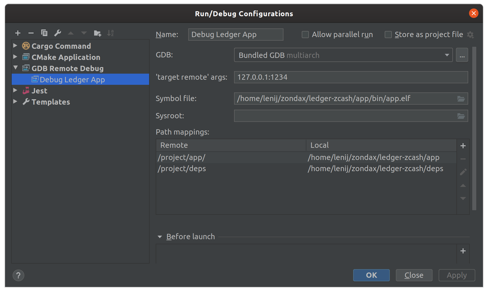

# Ledger Polkadot app
[](https://opensource.org/licenses/Apache-2.0)
[](https://circleci.com/gh/Zondax/ledger-polkadot)

>NOTE: The minor value in the version number indicates runtime compatibility. For instance: 0.1042.1, Indicates that the app is compatible with runtime 1042*

This project contains the Polkadot app (https://polkadot.network/) for Ledger Nano S and X.

- Ledger Nano S/X BOLOS app
- Specs / Documentation
- C++ unit tests
- Zemu tests

## ATTENTION

Please:

- **Do not use in production**
- **Do not use a Ledger device with funds for development purposes.**
- **Have a separate and marked device that is used ONLY for development and testing**

Tip:

- In releases, you will find a precompiled test app. If you are just curious, you can run `install_app.sh` and avoid building.

## Download and install

*Once the app is approved by Ledger, it will be available in their app store (Ledger Live).
You can get builds generated by CircleCI from the release tab. THESE ARE UNVETTED DEVELOPMENT RELEASES*

Download a release from here (https://github.com/Zondax/ledger-kusama/releases). You only need `installer_s.sh`

If the file is not executable, run
```sh
chmod +x ./installer_s.sh
```

then run:

```sh
./installer_s.sh load
```

# Development

## Preconditions

- Be sure you checkout submodules too:

    ```
    git submodule update --init --recursive
    ```

- Install Docker CE
    - Instructions can be found here: https://docs.docker.com/install/

- We only officially support Ubuntu. Install the following packages:
   ```
   sudo apt update && apt-get -y install build-essential git wget cmake \
  libssl-dev libgmp-dev autoconf libtool
   ```

- Install `node > v14.0`. We typically recommend using `n`

- You will need python 3 and then run
    - `make deps`

- This project requires Ledger firmware 1.6.1
    - The current repository keeps track of Ledger's SDK but it is possible to override it by changing the git submodule.

*Warning*: Some IDEs may not use the same python interpreter or virtual enviroment as the one you used when running `pip`.
If you see conan is not found, check that you installed the package in the same interpreter as the one that launches `cmake`.

## How to build ?

> We like clion or vscode but let's have some reproducible command line steps
>

- Building the app itself

    If you installed the what is described above, just run:
    ```bash
    make
    ```

## Running tests

- Running rust tests (x64)

    If you installed the what is described above, just run:
    ```bash
    make rust_test
    ```

- Running C/C++ tests (x64)

    If you installed the what is described above, just run:
    ```bash
    make cpp_test
    ```

- Running device emulation+integration tests!!

   ```bash
    Use Zemu! Explained below!
    ```

## How to test with Zemu?

> What is Zemu?? Great you asked!!
> As part of this project, we are making public a beta version of our internal testing+emulation framework for Ledger apps.
>
> Npm Package here: https://www.npmjs.com/package/@zondax/zemu
>
> Repo here: https://github.com/Zondax/zemu

Let's go! First install everything:
> At this moment, if you change the app you will need to run `make` before running the test again.

```bash
make zemu_install
```

Then you can run JS tests:

```bash
make zemu_test
```

To run a single specific test:

> At the moment, the recommendation is to run from the IDE. Remember to run `make` if you change the app.

## How to debug a Ledger app?

You can use vscode or clion to debug the app. We recommend using CLion but we provide a vscode (unsupported) configuration too.

### Preconditions

If you are using CLion, you need to a configuration file in your home directory: `$HOME/.gdbinit` with the following content:

```
set auto-load local-gdbinit on
add-auto-load-safe-path /
```

### Warnings

There are a few things to take into account when enabling Ledger App debugging:

- Once you enable the local .gdbinit that is located in your project workspace. You **will break** local Rust debugging in your host. The reason is that debugging unit tests will use the same `.gdbinit` configuration that sets the environment to ARM. We are looking at some possible fixes. For now, if you want to debug unit tests instead of the ledger app, you need to comment out the lines in `.gdbinit`

### Debugging

1. Build your app

    ```bash
    make
    ```

2. Define your debug scenario

    Open `tests/zemu/tools/debug.mjs` and look for the line:

    ```bash
    /// TIP you can use zemu commands here to take the app ...
    ```

    You can adjust this code to get the emulator to trigger a breakpoint in your app:
    - send clicks
    - send APDUs, etc

3. Launch the emulator in debug mode

    > If you didnt install Zemu yet (previous section), then run `make zemu_install`

    ```bash
    make zemu_debug
    ```

    The emulator will launch and immediately stop. You should see a black window

4. Configure Clion debugger

    Your configuration should look similar to this:

     

    Check that the path mappings are correct

5. Start CLion debugger

    You will hit a breakpoint in main.
    Add breakpoints in other places and continue.

    Enjoy :)

## Using a real device

### How to prepare your DEVELOPMENT! device:

>  You can use an emulated device for development. This is only required if you are using a physical device
>
>    **Please do not use a Ledger device with funds for development purposes.**
>>
>    **Have a separate and marked device that is used ONLY for development and testing**

   There are a few additional steps that increase reproducibility and simplify development:

**1 - Ensure your device works in your OS**
- In Linux hosts it might be necessary to adjust udev rules, etc.

  Refer to Ledger documentation: https://support.ledger.com/hc/en-us/articles/115005165269-Fix-connection-issues

**2 - Set a test mnemonic**

Many of our integration tests expect the device to be configured with a known test mnemonic.

- Plug your device while pressing the right button

- Your device will show "Recovery" in the screen

- Double click

- Run `make dev_init`. This will take about 2 minutes. The device will be initialized to:

   ```
   PIN: 5555
   Mnemonic: equip will roof matter pink blind book anxiety banner elbow sun young
   ```

**3 - Add a development certificate**

- Plug your device while pressing the right button

- Your device will show "Recovery" in the screen

- Click both buttons at the same time

- Enter your pin if necessary

- Run `make dev_ca`. The device will receive a development certificate to avoid constant manual confirmations.

## Building the Ledger App

### Loading into your development device

The Makefile will build the firmware in a docker container and leave the binary in the correct directory.

- Build

   ```
   make                # Builds the app
   ```

- Upload to a device

   The following command will upload the application to the ledger:

   _Warning: The application will be deleted before uploading._
   ```
   make load          # Builds and loads the app to the device
   ```

## APDU Specifications

- [APDU Protocol](docs/APDUSPEC.md)
